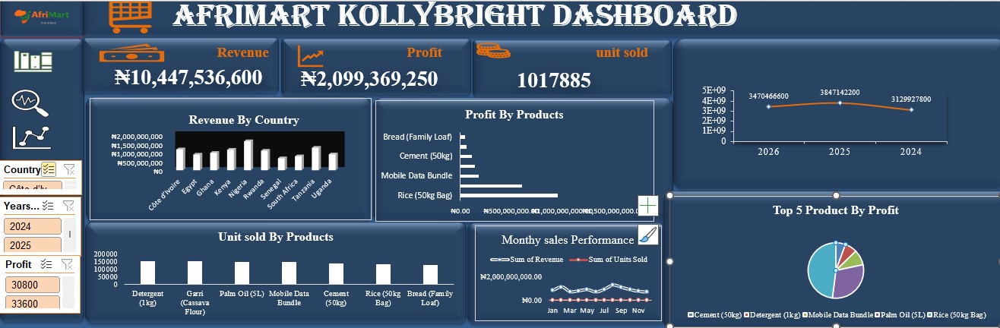

# AfriMart_Dashboard
An interactive sales performance dashboard built with Ms-Excel using Pivot tables, Pivot chart,and Slicer to analyze revenue =, profit, unit sold,and montly sales trend.
# AfriMart_Kollbright_Sales_Dashboard
An interactive sales performance dashboard built with Ms-Excel using Pivot tables, Pivot chart,and Slicer to analyze revenue, profit, unit sold,and montly sales trend.

___
## Project Overview
The AfriMart Kollybright Sales Dashboard is an interactive business intelligence dashboard designed to analyze sales performance, revenue, profit, and product sales across different African countries and years.
The dashboard provides a clear overview of AfriMart's business performance and helps stakeholders understand which countries, products, and periods contribute most to revenue and profit.
The analysis covers sales from 2024 to 2026 and presents the results through interactive charts, KPIs, and visual reports.

___
## Business Questions

This dashboard was created to answer the following key business questions:
- What is the total revenue generated by AfriMart?
- What is the total profit generated?
- How many units of products were sold?
- Which countries generated the most revenue?
- What are the top 5 products by profit?

___
## Key Performance Indicators (KPIs)
KPI	Value
- Total Revenue	
- Total Profit	
- Total Units Sold	

___
 ## Tools Used
- Microsoft Excel – Data cleaning, analysis and dashboard development
- Excel Pivot Tables – Data aggregation and analysis
- Excel Charts – Data visualization
- Excel Slicers – Interactive filtering
- Data Analysis – Revenue, profit, product and country performance analysis

___
  ## Dashboard Preview

___
## Key Insights
- Strong overall business performance
- Healthy profitability
- Product performance varies
- Different countries have different revenue contributions
- Sales volume provides another performance perspective

___
## Files in Repository
- [Sales Dataset](012_AfriMart_KollyBright_Sales_Dataset.xlsx)
- [Dashbord Screenshot](AfriMart_Dashbord_screenshot.jpg)
- [Company Logo](012_AfriMart_KollyBright_Sales_Dataset.png)
- ReadME.md

___
## Recommendations
Based on the analysis, AfriMart should:

- Investigate the reasons behind the decline in revenue after 2025.
- Focus marketing and inventory efforts on high-performing countries.
- Prioritize products with strong profit contributions.
- Continue tracking profit margins alongside revenue to ensure revenue growth translates into actual business profitability.

___
  ## Conclusion

The AfriMart Kolbright Sales Dashboard provides a comprehensive view of the company's sales and financial performance across different countries, products, and years. The analysis shows that AfriMart generated ₦10.45 billion in revenue, ₦2.10 billion in profit, and sold more than 1 million units during the period analyzed. The dashboard enables decision-makers to quickly identify revenue trends, profitable products, high-performing markets, and areas requiring improvement.

Overall, the project demonstrates how Excel and data visualization can transform raw sales data into actionable business insights and support data-driven decision-making.
